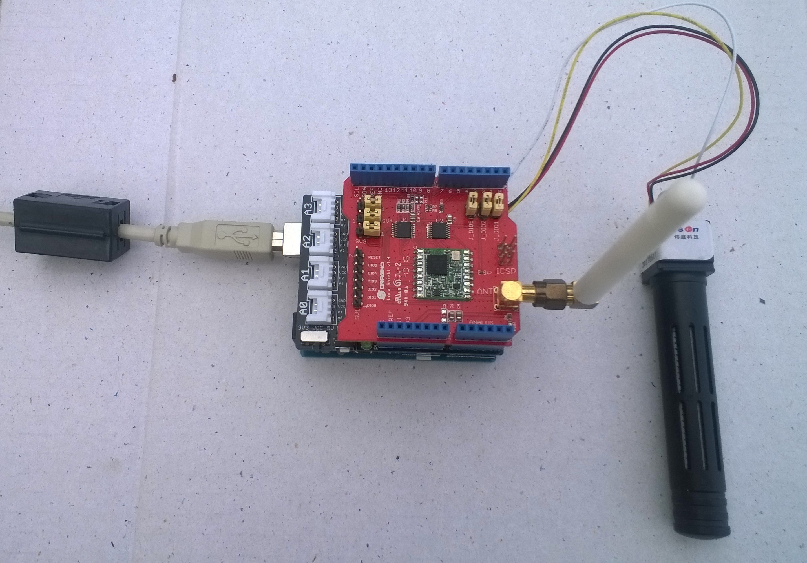

# FieldGateway.LoRa.DuinoClientCO2
Sample CO2 Sensor monitor for my [LoRa](https://lora-alliance.org/) field gateway projects

I used the [Arduino-Lora](https://github.com/sandeepmistry/arduino-LoRa) & [Sandbox Electronics NDIR](https://github.com/SandboxElectronics/NDIR) libraries, thank you to the authors Sandeep Mistry & Sandbox Electronics.

Device options

* [Arduino Uno R3](https://www.seeedstudio.com/Arduino-Uno-Rev3-p-2995.html)
* [Seeeduno V4.2](https://www.seeedstudio.com/Seeeduino-V4-2-p-2517.html)

LoRa shield options tested

* [Dragino 433/868/915Mz](http://www.dragino.com/products/lora/item/102-lora-shield.html)

* [Elecrow 915MHz](https://www.elecrow.com/lora-rfm95-shield-915mhz.html)

* [MakerFabs 433MHz](https://makerfabs.com/index.php?route=product/product&product_id=131)

* [MakerFabs 868MHz](https://makerfabs.com/index.php?route=product/product&product_id=130)

Extras

* [SeeedStudio Grove - Carbon Dioxide Sensor(MH-Z16)](https://www.seeedstudio.com/Grove-Carbon-Dioxide-Sensor-MH-Z1-p-1863.html)

Need a professional grade sensor to compare results with to check accuracy. 
